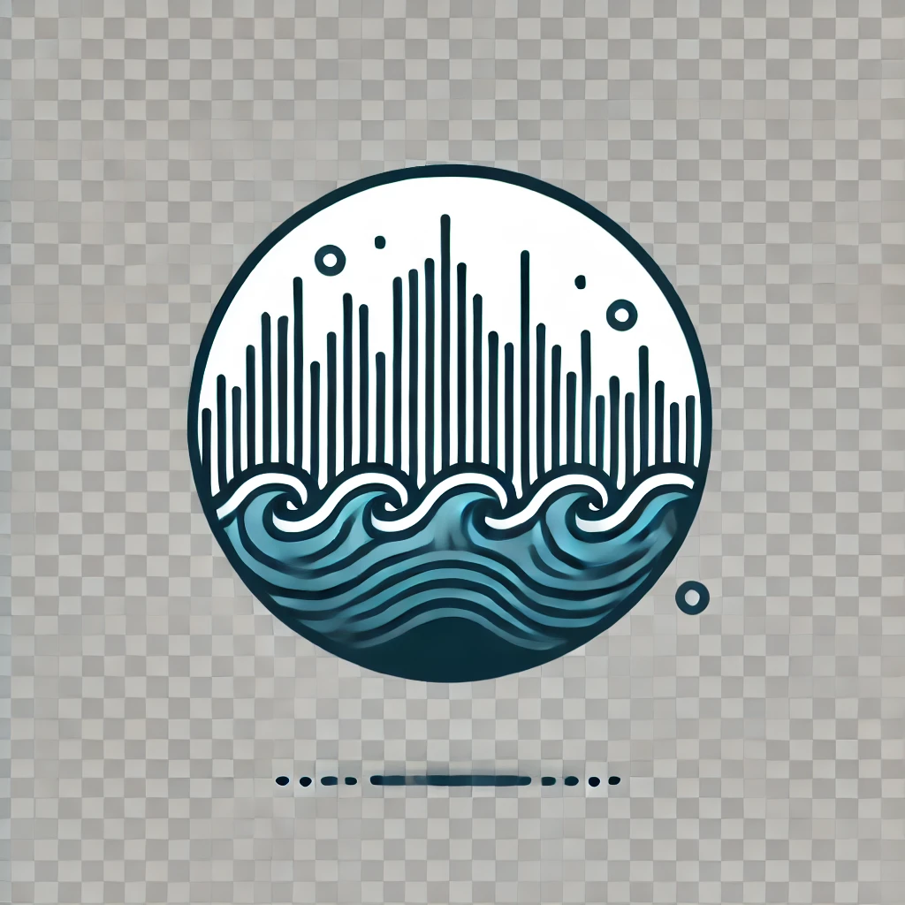

# Trackify  
Tracks your daily Spotify data and provides insightful stats about your listening habits.  

## Features  
- **Currently Playing Section:**  
  Displays your currently playing track with a vibrant design that matches the prominent colors of the cover art.  

- **Daily Minutes Tracker:**  
  Tracks and updates the total minutes you listen to music daily.  

- **Friend Activity (Optional):**  
  View your friends' listening activity in real-time.  

- **Future Additions:**  
  - YouTube Music stats integration.  
  - Google Login functionality.
  - Secure authentication practices, hiding tokens etc
  

## Live Demo  
Check out the live version here: [Trackify](https://add2207.github.io/Trackify).  
